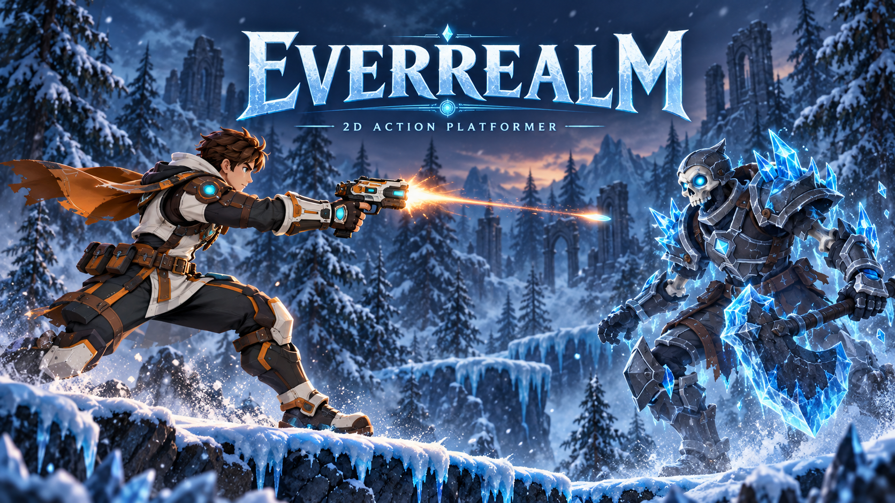
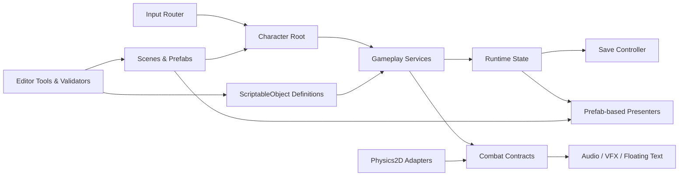

# Everrealm



<p align="center">
  <strong>A data-driven 2D action-platformer vertical slice built with Unity 6.</strong><br>
  Responsive traversal, projectile combat, character progression, loot, trading, and a custom node-based Skill Tree — supported by a production-minded runtime architecture and dedicated Unity Editor tools.
</p>

<p align="center">
  
  
  
  
  
</p>

## Overview

**Everrealm** is a single-player 2D action platformer set in a frozen fantasy world where ancient ruins, hostile creatures, and arcane technology meet. The player crosses layered winter environments, fights enemies with ranged attacks and unlockable abilities, gathers loot, develops a combat profession, and trades with an in-world merchant.

The project is designed as more than a gameplay prototype. It demonstrates how a compact game can be built around maintainable production systems: gameplay rules live in testable services, content is authored through ScriptableObjects, UI is composed from prefabs, runtime state is saved through stable identifiers, and custom Editor tools support the content workflow.

> **Current scope:** a playable portfolio vertical slice in active development. The repository contains one main gameplay level, focused debug scenes, reusable gameplay systems, authored content, and an EditMode regression suite. It is currently a local single-player project.

## Gameplay Pillars

| Pillar | Player experience |
|---|---|
| **Responsive traversal** | Run, sprint, jump, fall, and land across icy 2D platforms with animation-aware collision and ground detection. |
| **Readable combat** | Fire projectiles, chain attacks, activate learned skills, and receive clear hit, damage, audio, and VFX feedback. |
| **Character growth** | Earn experience, level up, purchase profession nodes, and turn passive and active upgrades into a personalized build. |
| **Meaningful rewards** | Defeated enemies drop physical loot and currency that scatter, fall onto platforms, and remain collectible in the world. |
| **Inventory decisions** | Collect equipment, materials, Health Potions, and Energy Potions; assign consumables and abilities to the Skill Bar. |
| **World economy** | Interact with a merchant to buy catalog items or sell eligible inventory items through a transactional shop system. |

## Implemented Features

### Player and movement

- Rigidbody2D-based platforming with configurable movement and jump data.
- Coyote time, input buffering, guarded jump impulses, and explicit jump/fall/landing states.
- Animation-aware airborne collider resizing with ground checks aligned to the collider's lower edge.
- Independent locomotion and upper-body attack animation state, preventing combat from blocking movement transitions.
- Camera-driven parallax layers with reusable horizontal segments.

### Combat and abilities

- Projectile-based basic attack and skill casting.
- Centralized `CombatService` for damage resolution, defense, critical hits, damage tags, hit direction, and death transitions.
- Auto-attack combo definitions with ordered steps, reset windows, multipliers, and finisher profiles.
- Data-defined active skills, buffs, passive effects, empowers, cooldowns, Energy costs, and target limits.
- Per-skill projectile, launch sound, impact sound, VFX, and fallback presentation profiles.
- Floating damage text, pooled impact effects, hit reactions, knockback, and invulnerability windows.
- Successful actions drive animation and feedback; failed casts such as insufficient Energy do not play attack animations.

### Enemies

- Skeleton and golem enemy prefabs with dedicated presentation adapters.
- Patrol, detection, chase, stop-distance, and attack behavior.
- Damage aggro: attacking an enemy causes it to pursue and engage the player.
- Grounded death flow that preserves collision long enough for the death animation to finish.
- Configurable enemy attacks, experience rewards, and loot tables.

### Progression and Skill Tree

- Experience thresholds, level progression, level-up events, and an animated level-up banner/VFX.
- Profession-driven node graph with prerequisites, prices, ranks, and runtime effects.
- Active, passive, buff, empower, and auto-attack-upgrade skill types.
- Transactional purchases and respec validation.
- Automatic assignment of purchased active abilities to free Skill Bar slots.
- Conflict-safe Skill Bar behavior: abilities and consumables cannot silently occupy the same slot.
- Persistent profession, node-rank, learned-skill, and loadout state using stable IDs.

### Inventory, loot, and economy

- Slot-based inventory with stack merging, capacity checks, and read-only UI presentation.
- ScriptableObject item database for equipment, materials, and consumables.
- Weighted loot tables with deterministic random-source support for tests.
- Physical world drops with independent offsets, gravity, platform collision, and pickup triggers.
- Currency wallet and transactional buy/sell operations.
- Per-shop `ShopCatalogDefinition`, allowing different merchants to offer different inventories.
- Interactive world merchant with an authored interaction prompt and synchronized Shop/Inventory windows.
- Health and Energy consumables can be dragged from inventory to the Skill Bar, display stack quantity, and disappear from the bar when depleted.

### UI, audio, and feedback

- Prefab-authored HUD, Skill Bar, inventory, merchant, stats, pause menu, and Skill Tree interfaces.
- Shared row and action-button prefabs for consistent shop styling.
- Health, Energy, experience, level, currency, cooldown, and quantity presentation sourced from live runtime state.
- Audio mixer routing for music, combat SFX, and UI feedback with persistent volume settings.
- Dedicated Health Potion, Energy Potion, level-up, projectile, and impact effects.
- Input blocking while modal interfaces are open.

### Save and persistence

- JSON save file for level progress, experience, currency, inventory, Skill Tree ranks, skill loadout, and consumable slots.
- Transaction-oriented autosave after complete gameplay operations rather than intermediate mutations.
- Restore guards that avoid replaying level-up feedback while loading.
- Compatibility handling for older or conflicting Skill Bar save data.

## Custom Unity Editor Tooling

Everrealm includes a focused authoring toolkit so designers can create, inspect, validate, and rebuild content without editing runtime code.

| Tool | Purpose |
|---|---|
| **Skill Tree Editor** | Visual node-graph authoring for profession skills, prerequisites, prices, ranks, icons, and layout. Open with `Everrealm > Skill Tree > Editor`. |
| **Profession Skill Tree Builder** | Builds and wires the prefab-authored Skill Tree presentation into the target scene. |
| **Skill Tree Validator** | Checks stable IDs, missing references, illegal ranks, prerequisite integrity, and cycles before playtesting. |
| **Runtime Save Inspector** | Inspects and operates on the live player's save/progression state in Play Mode without adding debug controls to production components. |
| **All Skills Catalog** | Provides a centralized overview of skill types, effects, and authored configuration. |
| **Scene setup pipeline** | Focused builders create or configure combat, character, inventory, shop, audio, feedback, stats, pause-menu, and Skill Bar scene composition. |
| **Projectile Builder** | Generates and configures individual skill projectile prefabs from authored definitions. |
| **SoftKitty UI Builders** | Compose editable prefab-based inventory, merchant, stats, and bottom Skill Bar visuals while preserving runtime logic. |
| **Audio and VFX Builders** | Wire scene audio routing and player feedback prefabs through explicit serialized references. |

The setup tools are Editor-only. Runtime systems never depend on an Editor builder and do not silently create replacement UI or gameplay objects during Play Mode.

## Architecture

The codebase follows a data-driven, layered architecture built around small MonoBehaviour adapters, plain C# services, explicit contracts, and ScriptableObject configuration.



### Core design principles

- **No gameplay singletons:** gameplay dependencies are explicit through serialized references, composition roots, constructors, and interfaces.
- **Data is separate from state:** ScriptableObjects contain authoring data; mutable progression, cooldown, inventory, and combat state lives in runtime objects.
- **Gameplay is separate from presentation:** UI, animation, sound, and VFX react to outcomes but do not own combat truth.
- **Combat has one route:** damage is resolved through combat contracts and `CombatService`.
- **Prefab-first UI:** visible controls and layout are authored in prefabs; presenters bind data and reuse configured views.
- **Transaction-oriented progression:** purchases, refunds, inventory changes, and autosave commit only after the complete operation succeeds.
- **Testable boundaries:** targeting, randomness, combat, shops, progression, and loadouts expose deterministic seams for EditMode tests.

### Representative runtime flows

```text
Input -> CharacterRoot -> SkillService -> SkillEffect -> CombatService -> Target
                                                          |
                                                          +-> Audio / VFX / Damage Text

Enemy Death -> LootTable Roll -> World Pickup -> Inventory / CurrencyWallet

Skill Tree Node -> Purchase Validation -> Runtime Rank Effects -> Skill Loadout -> Skill Bar

World Merchant -> ShopInteraction2D -> ShopService -> Inventory + CurrencyWallet -> Prefab UI
```

More detail is available in the project's [architecture source of truth](Everrealm_2D/Assets/_Game/Docs/Architecture.md) and [development roadmap](Everrealm_2D/Assets/_Game/Docs/DevelopmentRoadmap.md).

## Technology Stack

| Area | Technology |
|---|---|
| Engine | Unity `6000.3.3f1` / Unity 6.3 LTS |
| Language | C# / .NET profile provided by Unity |
| Rendering | Universal Render Pipeline 17.3, 2D Renderer, Sprite and Tilemap workflows |
| Input | Unity Input System 1.17 |
| Camera | Cinemachine 3.1 |
| Animation | Unity 2D Animation, Animator state machines, sprite animation |
| UI | Unity UI (`uGUI`), TextMeshPro, prefab-authored views and presenters |
| Content | ScriptableObjects, prefabs, Tilemaps, PSD/Aseprite import tooling |
| Physics | Unity Physics2D, Rigidbody2D, colliders, overlap/raycast targeting adapters |
| Audio | AudioSource, AudioMixer, per-skill SFX configuration and fallbacks |
| Persistence | Version-tolerant JSON save data with stable content identifiers |
| Testing | Unity Test Framework 1.6, NUnit EditMode regression tests |
| Tooling | Custom Unity Editor windows, inspectors, validators, and idempotent setup builders |
| Integration | Unity MCP package for project-assisted Editor workflows |

## Testing and Quality

The project currently contains **83 authored EditMode test attributes** across gameplay and UI regression suites. Coverage includes:

- combat calculations, critical hits, damage tags, and death transitions;
- skill registration, Energy validation, cooldowns, buffs, passives, and empower behavior;
- movement/state-machine regressions;
- inventory stacking and capacity;
- loot-table rolls and world-drop configuration;
- shop transactions and prefab UI contracts;
- level progression and save/load persistence;
- Skill Tree purchases, ranks, loadout assignment, and consumable-slot conflicts;
- projectile configuration, damage, audio, and visual references;
- parallax and HUD view-model behavior.

Run the suite from Unity:

```text
Window > General > Test Runner > EditMode > Run All
```

Compile the generated project from PowerShell:

```powershell
dotnet build Everrealm_2D/Assembly-CSharp.csproj --nologo -v minimal
dotnet build Everrealm_2D/LetterHunter.EditModeTests.csproj --nologo -v minimal
```

## Project Structure

```text
Everrealm_2D_Platformer/
├── Portfolio/                         # Portfolio presentation assets
├── Everrealm_2D/                      # Unity project root
│   ├── Assets/_Game/
│   │   ├── Data/                      # ScriptableObject content and databases
│   │   ├── Docs/                      # Architecture and development notes
│   │   ├── Prefabs/                   # Characters, enemies, UI, VFX, loot, projectiles
│   │   ├── Scenes/                    # Main level and focused debug scenes
│   │   ├── Scripts/
│   │   │   ├── Characters/            # Movement, input, animation, enemy behavior
│   │   │   ├── Combat/                # Damage contracts, attacks, projectiles
│   │   │   ├── Skills/ & SkillTree/   # Ability runtime and progression graph
│   │   │   ├── Items/ Loot/ Economy/  # Inventory, drops, currency, merchant
│   │   │   ├── Save/                  # Persistent runtime state
│   │   │   ├── UI/ Feedback/ Audio/   # Presentation layer
│   │   │   └── Editor/                # Custom authoring and validation tools
│   │   └── Tests/Editor/              # NUnit EditMode regression suite
│   ├── Packages/
│   └── ProjectSettings/
└── README.md
```

## Controls

| Action | Input |
|---|---|
| Move | `A` / `D` |
| Sprint | `Left Shift` |
| Jump | `Space` |
| Basic attack | `J` or left mouse button outside UI |
| Interact with merchant | `I` |
| Skill Bar slots | `1`–`4` for the default configured slots, or click a slot |
| Pause / close modal UI | `Escape` |

Controls are routed through `CharacterInputRouter` and remain configurable through serialized key fields.

## Getting Started

### Requirements

- Unity Hub
- Unity Editor `6000.3.3f1`
- Git

### Open the project

```bash
git clone https://github.com/kirillmakarov-dev/Everrealm_2D_Platformer.git
```

1. Add the nested `Everrealm_2D` directory as the project in Unity Hub.
2. Open the project with Unity `6000.3.3f1`.
3. Open `Assets/_Game/Scenes/Game level 1.unity`.
4. Enter Play Mode.

The repository intentionally excludes generated Unity folders such as `Library`, `Temp`, `Logs`, and `UserSettings`.

### Third-party presentation assets

Some authored UI presentation references use a locally licensed **SoftKitty** Asset Store package. The package itself is intentionally not redistributed in this public source repository. Import the compatible package into `Assets/SoftKitty` when reproducing the complete authored UI appearance. All custom gameplay architecture, runtime presenters, prefab contracts, and Editor integration code remain part of this repository.

## Engineering Focus

This project demonstrates:

- designing extensible gameplay systems instead of scene-specific scripts;
- balancing Unity-friendly composition with plain C# testability;
- building designer-facing tools and validation into the content pipeline;
- maintaining save compatibility while systems evolve;
- separating gameplay truth from UI, audio, animation, and VFX;
- debugging real platformer physics, animation transitions, AI pursuit, and UI state conflicts;
- delivering a cohesive playable slice with production-oriented architecture.

## Author

**Kirill Makarov**<br>
Unity / C# Developer<br>
[GitHub](https://github.com/kirillmakarov-dev)

---

<p align="center">
  <strong>Everrealm is an actively developed portfolio project.</strong><br>
  The focus is a polished gameplay slice backed by clear architecture, reusable content workflows, and verifiable systems.
</p>
